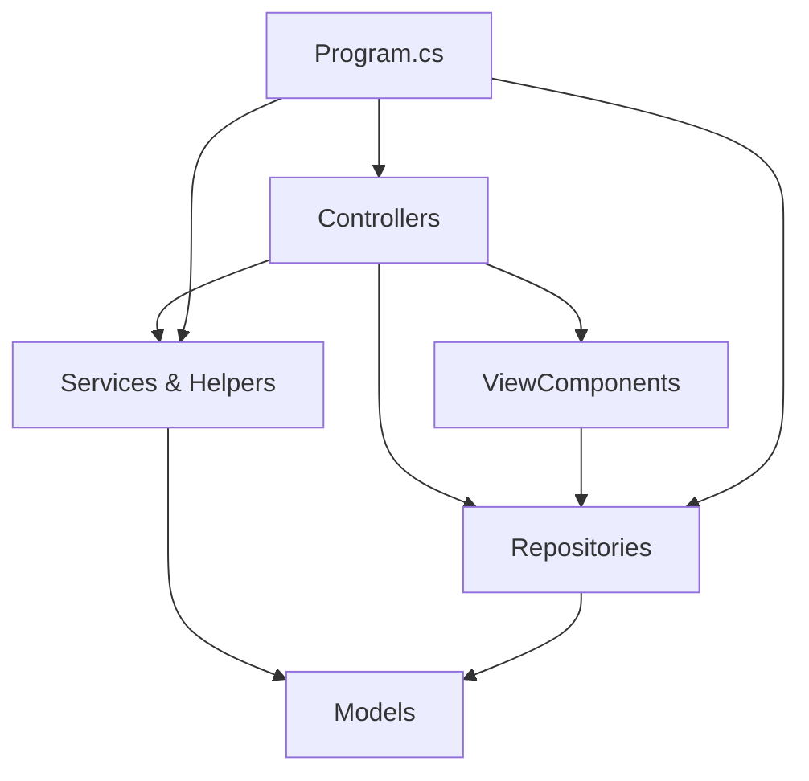

# MvcCore Utilidades

MvcCore Utilidades is a comprehensive ASP.NET Core MVC utilities library built on .NET 10.0 that provides essential tools and helpers for modern web application development. It demonstrates best practices for common web development tasks including file uploads, caching, encryption, email sending, and session management.

## What is MvcCore Utilidades?

MvcCore Utilidades is a production-ready ASP.NET Core MVC application that showcases practical implementations of frequently needed utilities in web development. It serves both as a learning resource and as a foundation for building robust web applications.

The project follows modern ASP.NET Core patterns with:
- Dependency injection for all services
- Repository pattern for data access
- Helper classes for cross-cutting concerns
- View Components for reusable UI elements
- Clean separation of concerns

## Key Features

<CardGroup cols={2}>
  <Card title="File Management" icon="file-arrow-up">
    Upload and manage files with the **HelperPathProvider** utility that handles physical and URL path mapping for different file types (images, uploads, invoices, temporary files).
  </Card>
  
  <Card title="Cryptography" icon="lock">
    Secure data encryption with **HelperCryptography** supporting both basic SHA1 encryption and advanced SHA512 with salt for password hashing and data protection.
  </Card>
  
  <Card title="Caching Strategies" icon="database">
    Implement both in-memory caching with `IMemoryCache` and distributed caching with configurable expiration times and cache invalidation strategies.
  </Card>
  
  <Card title="Email Integration" icon="envelope">
    Send emails through SMTP with full configuration support, including SSL, authentication, and HTML content via the `MailsController`.
  </Card>
  
  <Card title="Session Management" icon="user">
    Built-in session handling for user authentication and state management across requests.
  </Card>
  
  <Card title="Repository Pattern" icon="folder-tree">
    Data access abstraction with `RepositoryCoches` demonstrating clean separation between business logic and data layer.
  </Card>
  
  <Card title="View Components" icon="cube">
    Reusable UI components like `MenuCochesViewComponent` for building modular and maintainable views.
  </Card>
  
  <Card title="Partial Views & AJAX" icon="code">
    Dynamic content loading with partial views for responsive user experiences.
  </Card>
</CardGroup>

## Architecture Overview

The application follows a clean architecture pattern:



### Core Components

#### Controllers
- **HomeController**: Session management and authentication
- **UploadFilesController**: File upload handling
- **CifradosController**: Encryption operations
- **CachingController**: Caching demonstrations
- **MailsController**: Email sending functionality
- **CochesController**: CRUD operations with repository pattern

#### Helpers
- **HelperPathProvider**: Path resolution for file operations
- **HelperCryptography**: Encryption and hashing utilities

#### Repositories
- **RepositoryCoches**: Data access layer for Car entities

#### View Components
- **MenuCochesViewComponent**: Dynamic car menu rendering

## Technology Stack

<Note>
  MvcCore Utilidades is built on the latest .NET technologies:
</Note>

- **.NET 10.0**: The latest version of .NET with enhanced performance and new features
- **ASP.NET Core MVC**: Modern web framework with razor views
- **Microsoft.Extensions.Caching.Memory**: In-memory caching support
- **System.Net.Mail**: Email sending capabilities
- **System.Security.Cryptography**: Encryption and hashing

## Use Cases

MvcCore Utilidades is ideal for:

- **Learning ASP.NET Core**: Study real-world implementations of common patterns
- **Starter Templates**: Bootstrap new projects with proven utilities
- **Enterprise Applications**: Production-ready components for business applications
- **Rapid Prototyping**: Quickly implement authentication, file uploads, and caching
- **Code Reference**: Examples of best practices for ASP.NET Core development

## Project Structure

```bash
MvcCoreUtilidades/
├── Controllers/          # MVC Controllers
├── Models/              # Data models and view models
├── Repositories/        # Data access layer
├── Helpers/             # Utility classes
├── ViewComponents/      # Reusable view components
├── Views/               # Razor views
├── wwwroot/             # Static files
│   ├── images/         # Image uploads
│   ├── uploads/        # General uploads
│   └── facturas/       # Invoice files
└── Program.cs          # Application startup
```

<Warning>
  This project uses .NET 10.0. Ensure you have the .NET 10.0 SDK installed before proceeding.
</Warning>

## Next Steps

<CardGroup cols={2}>
  <Card title="Installation" icon="download" href="/installation">
    Get started by setting up MvcCore Utilidades in your environment
  </Card>
  
  <Card title="Quick Start" icon="rocket" href="/quickstart">
    Jump right in with practical examples and code snippets
  </Card>
</CardGroup>